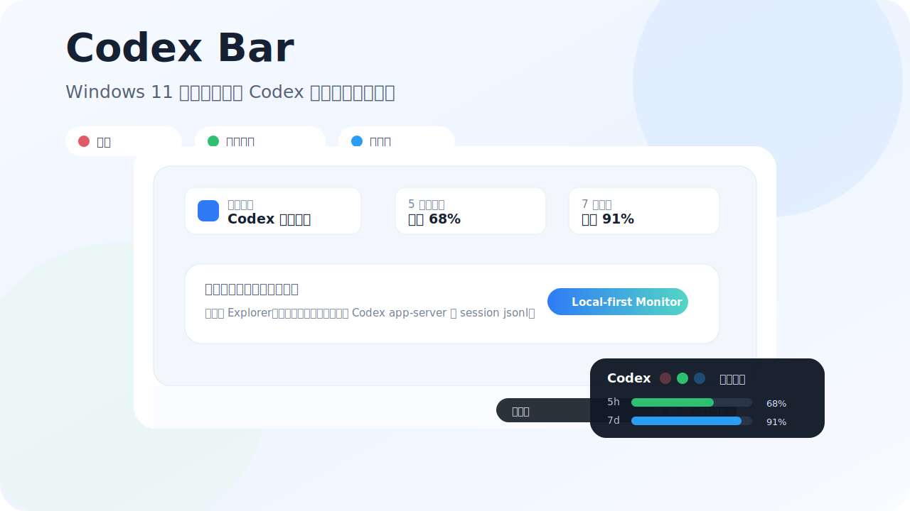
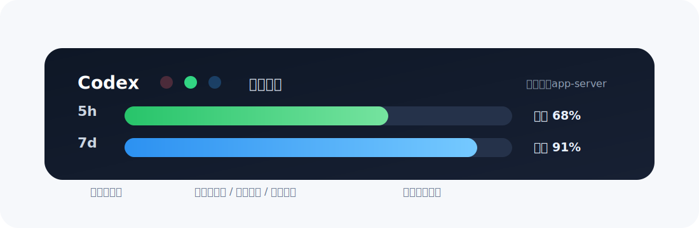
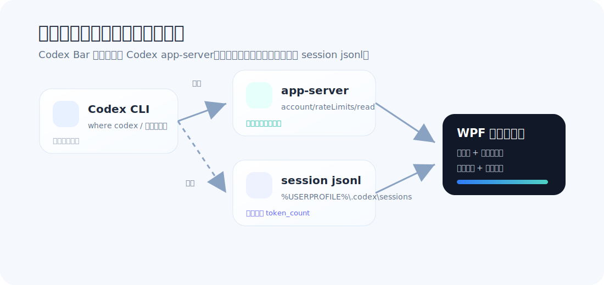
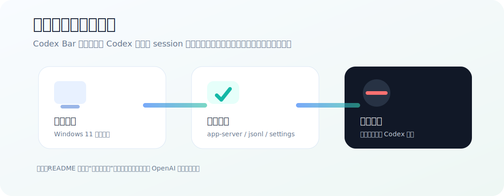

# Codex Bar

<p align="center">
  
</p>

<p align="center">
  <a href="https://github.com/NexxCaozhiwei/codex-bar/releases/latest"></a>
  <a href="LICENSE"></a>
  
  
</p>

**Codex Bar** 是一个非官方 Windows 11 桌面小工具，用于在任务栏通知区域附近显示 Codex 的工作状态、5 小时额度和 7 天额度剩余情况。它采用 Windows 原生 WPF 实现，不注入 Explorer，不修改系统任务栏，只以贴近任务栏的小型悬浮窗运行。

> 适合经常使用 Codex / VS Code Codex 插件的用户：不用反复切到终端或日志里确认状态，也不用等到额度耗尽才发现当前 5h 或 7d 窗口已经接近上限。

---

## 界面预览

<p align="center">
  
</p>

Codex Bar 默认以三行紧凑状态条显示：

| 行 | 内容 | 说明 |
|---|---|---|
| 第一行 | Codex 状态灯 + 状态文字 | 从左到右为绿灯、蓝灯、红灯。绿灯表示空闲 / 已完成，蓝灯表示正在工作 / 自动审查 / 等待用户，红灯表示错误。 |
| 第二行 | 5h 额度进度条 | 显示当前 5 小时窗口剩余额度；单击状态条可切换为重置倒计时。 |
| 第三行 | 7d 额度进度条 | 显示当前 7 天窗口剩余额度；单击状态条可切换为重置倒计时。 |

状态条支持单击切换剩余额度 / 重置倒计时，双击打开详情，右键打开菜单；未锁定位置时可以拖动，并可自动吸附到任务栏通知区域附近。

---

## 核心特性

- **任务栏附近悬浮**：靠近 Windows 11 右下角通知区域显示，不破坏任务栏原生结构。
- **Codex 活动识别**：从本地 Codex session 事件识别空闲、工作中、自动审查、等待用户、已完成、错误等状态，并用绿 / 蓝 / 红三灯快速区分。
- **双额度窗口**：同时显示 5 小时额度和 7 天额度的剩余比例，并可单击切换为重置倒计时。
- **数据源自动回退**：优先读取 `codex app-server --listen stdio://`；不可用时回退扫描本地 session `jsonl`。
- **系统托盘集成**：支持显示 / 隐藏、刷新、设置、置顶、锁定位置、开机启动和退出。
- **本地优先**：只读取本机 Codex 接口和本机 session 文件，不上传代码、日志或遥测数据。
- **无需管理员权限**：开机启动通过当前用户注册表项实现，不写入系统级位置。

---

## 工作方式

<p align="center">
  
</p>

Codex Bar 的读取逻辑分为两层：

1. **首选 app-server**  
   启动 `codex app-server --listen stdio://`，通过本地 stdin/stdout 协议请求 `account/rateLimits/read`，读取 Codex 的额度窗口数据。

2. **回退 jsonl**  
   当 Codex CLI 未找到、app-server 启动失败或接口返回不完整时，扫描：

   ```text
   %USERPROFILE%\.codex\sessions\**\*.jsonl
   ```

   并解析最近 session 中的 `token_count` / `rate_limits` 事件，尽量恢复可用额度信息。

活动状态则由最近 session 事件推断，例如 `agent_message`、`tool_call`、`auto_review`、`waiting_for_user`、`task_complete` 等。

---

## 安装

### 方式一：下载 Release

前往 [Releases](https://github.com/NexxCaozhiwei/codex-bar/releases/latest) 下载最新版本的 Windows x64 构建产物，解压后运行：

```powershell
CodexBar.exe
```

### 方式二：从源码构建

需要 Windows 11 x64 和 .NET 8 SDK。

```powershell
git clone https://github.com/NexxCaozhiwei/codex-bar.git
cd codex-bar

dotnet restore
dotnet build -c Release

dotnet publish src/CodexBar/CodexBar.csproj `
  -c Release `
  -r win-x64 `
  --self-contained true `
  -p:PublishSingleFile=true `
  -p:IncludeNativeLibrariesForSelfExtract=true `
  -p:PublishTrimmed=false `
  -o artifacts/publish/win-x64
```

运行：

```powershell
artifacts\publish\win-x64\CodexBar.exe
```

---

## 使用说明

| 操作 | 效果 |
|---|---|
| 单击状态条 | 在剩余额度和重置倒计时之间切换。 |
| 双击状态条 | 打开详情窗口。 |
| 右键点击状态条 | 打开快捷菜单。 |
| 右键点击托盘图标 | 打开托盘菜单。 |
| 拖动状态条 | 未锁定时调整显示位置。 |
| 设置页 | 配置 Codex 命令路径、刷新间隔、置顶、开机启动、自动吸附和语言选项。 |

常用建议：

- 第一次启动后，先在托盘菜单执行一次 **刷新**。
- 如果状态条挡住窗口，可以在菜单中取消置顶，或锁定到更靠近任务栏的位置。
- 如果 Codex 安装在非默认路径，请在设置页手动填写 Codex CLI 路径。

---

## Codex CLI 检测规则

Codex Bar 会按以下顺序寻找 Codex CLI：

1. 设置页中配置的自定义路径。
2. `where codex`
3. `where codex.cmd`
4. `where codex.exe`
5. 常见 npm 全局安装目录。

如果仍然找不到 Codex CLI，界面会显示明确提示，并尝试回退读取本地 session 日志。

---

## 开机启动

可在托盘菜单或设置页启用开机启动。Codex Bar 只写入当前用户注册表项：

```text
HKCU\Software\Microsoft\Windows\CurrentVersion\Run
```

这不需要管理员权限，也不会修改系统级启动项。

---

## 隐私与边界

<p align="center">
  
</p>

Codex Bar 是本地优先工具：

- 不上传用户代码。
- 不上传 Codex session 日志。
- 不收集遥测数据。
- 不注入 VS Code、Explorer 或 Windows 任务栏。
- 只读取本机 Codex app-server 响应、本机 session `jsonl` 文件和本地配置文件。

设置文件保存位置：

```text
%APPDATA%\CodexBar\settings.json
```

如果设置文件损坏，程序会备份为 `.bad-*` 文件，并重新创建默认设置。

---

## 已知限制

- Codex 本地 `app-server` 接口仍属于实验性接口，未来可能变化。
- AppBar docking 目前只保留互操作基础；默认采用更稳定的任务栏附近悬浮窗口模式。
- 当前版本对全屏应用的避让策略较保守。
- 如果 app-server 与本地 `jsonl` 日志都不可用，额度数据会显示为不可用。
- 本项目只显示和诊断本机可读取的信息，不绕过 Codex 的官方额度或访问控制。

---

## 项目结构

```text
codex-bar
├─ src/CodexBar/                 # WPF 主程序
│  ├─ Services/                  # Codex 定位、额度读取、日志解析、托盘、启动项等服务
│  ├─ ViewModels/                # 主窗口、设置、详情窗口的视图模型
│  ├─ Models/                    # 配置、额度快照、状态枚举等模型
│  └─ Resources/                 # 图标等资源
├─ tests/CodexBar.Tests/         # 单元测试
├─ docs/                         # 设计、协议与故障排查文档
├─ .github/workflows/            # GitHub Actions 构建发布流程
└─ README.md
```

---

## 故障排查

### 没有额度数据

请依次检查：

```powershell
where codex
codex --version
codex app-server --listen stdio://
```

同时确认本地是否存在 session 日志：

```text
%USERPROFILE%\.codex\sessions
```

### 缺少 .NET SDK

源码构建需要 .NET 8 SDK，而不只是 Runtime：

```powershell
winget install --id Microsoft.DotNet.SDK.8
dotnet --info
```

### GitHub Actions 或发布相关问题

如果需要在本机调试 Release 流程，可先确认 GitHub CLI：

```powershell
winget install --id GitHub.cli
gh auth login
gh auth status
```

更多内容见：

- [设计说明](docs/design.md)
- [Codex 数据协议](docs/protocol.md)
- [故障排查](docs/troubleshooting.md)

---

## 路线建议

后续可以逐步增强：

- 增加更细的状态识别，例如区分“正在编辑代码”“正在运行测试”“等待审批”。
- 增加额度历史趋势小图表。
- 增加主题色、透明度和尺寸预设。
- 增加全屏应用检测和自动隐藏策略。
- 增加便携版配置迁移功能。

---

## 非官方声明

Codex Bar 是非官方工具，并非 OpenAI 官方提供。项目只读取本机可访问的 Codex 状态与额度信息，不改变 Codex 的额度规则、访问控制或服务行为。

---

## 许可证

MIT。见 [LICENSE](LICENSE)。

---

## 致谢

本项目参考了 [Tongzh-SEU/Codex-Signal-Glance](https://github.com/Tongzh-SEU/Codex-Signal-Glance) 的产品思路。原项目是 MIT 许可的 macOS Codex 额度与活动状态查看工具。Codex Bar 是 Windows 原生重写，没有复制 Swift / macOS 实现代码。
